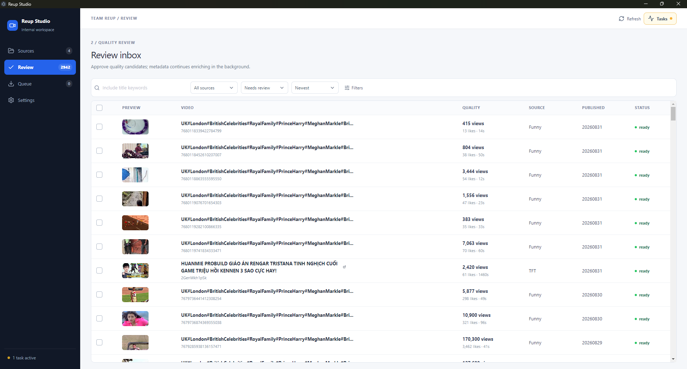

# Tool Download Video



Tool Download Video is a simple Windows desktop application for discovering, reviewing, and downloading videos from YouTube and TikTok.

It helps you manage multiple video sources in one place, organize downloads automatically, and avoid downloading the same video more than once.

## What You Can Do

- Manage YouTube and TikTok video sources.
- Automatically discover new videos from configured sources.
- Review video titles, thumbnails, durations, and metadata before downloading.
- Select and approve only the videos you want to download.
- Download multiple videos in parallel.
- Organize downloads into separate folders for each source.
- Track download history and prevent duplicate downloads.
- Import and export source lists using Excel files.
- Monitor crawling and download progress in real time.
- Use cookies or browser access for restricted content when necessary.

## How It Works

1. Add your video sources.
2. Start a crawl to find new videos.
3. Review the discovered videos.
4. Approve the videos you want.
5. Start the download queue.

The app starts with an empty source list, so you can configure your own workspace from the beginning.

## Supported Links

- YouTube channels and video pages
- YouTube Shorts
- TikTok profiles

## Installation

1. Download and run [Tool-Download-Video-Setup-1.0.3.exe](https://github.com/dinhvan2310/youtube-tiktok-downloader/releases/download/v1.0.3/Tool-Download-Video-Setup-1.0.3.exe).
2. Follow the installer steps.
3. Open Tool Download Video from the Desktop or Start Menu.

Python, FFmpeg, and ffprobe do not need to be installed separately. The application bundles its backend and media tools.

The installer is currently unsigned, so Windows SmartScreen may display a warning. Only run the installer if it came from a trusted source.

## Build from Source

Requirements:

- Windows
- Python 3.11 or newer
- Node.js 18 or newer

From the project root, create the Python environment and install the backend dependencies:

```powershell
py -3.11 -m venv .venv
.\.venv\Scripts\Activate.ps1
python -m pip install -r requirements.txt
```

Install Electron dependencies and create the installer:

```powershell
cd electron
npm install
npm run dist:installer
```

The build downloads the Windows FFmpeg archive, verifies its SHA-256 checksum, and bundles `ffmpeg.exe` and `ffprobe.exe` into the backend automatically.

The installer is created at:

`electron/dist/Tool-Download-Video-Setup-1.0.3.exe`

The build includes the Electron interface and the bundled Python backend. The installer can be shared with end users after a successful build.
